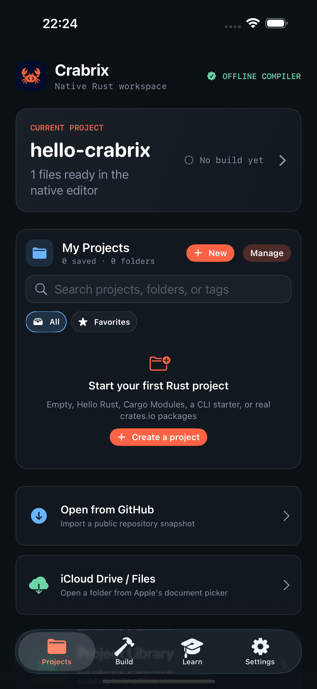
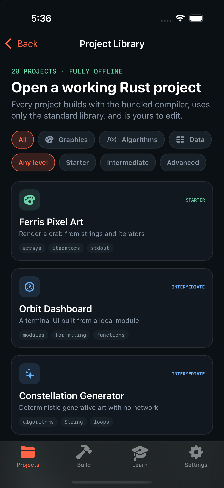
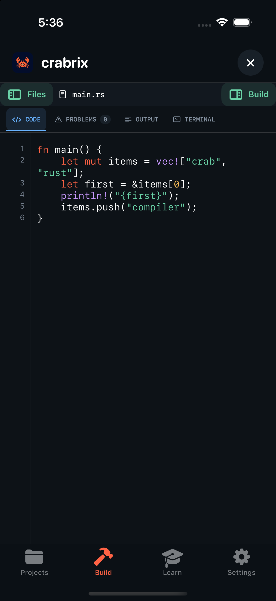
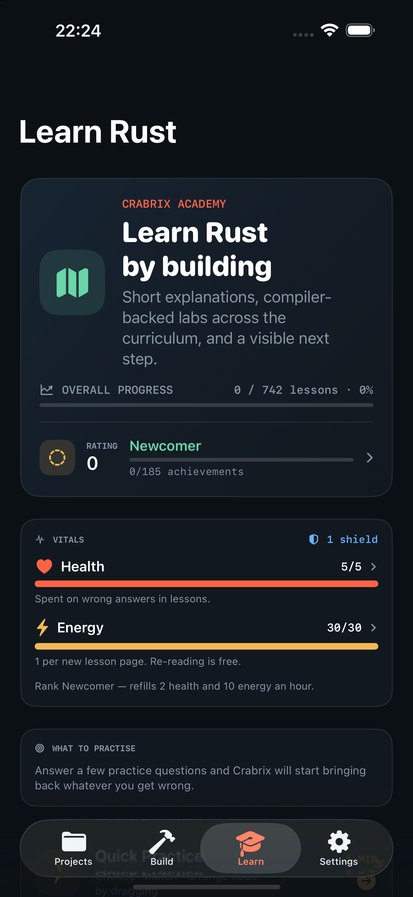
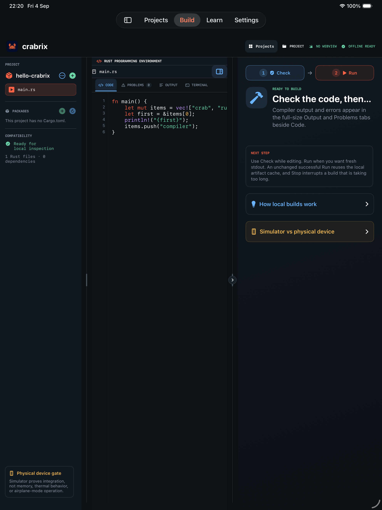
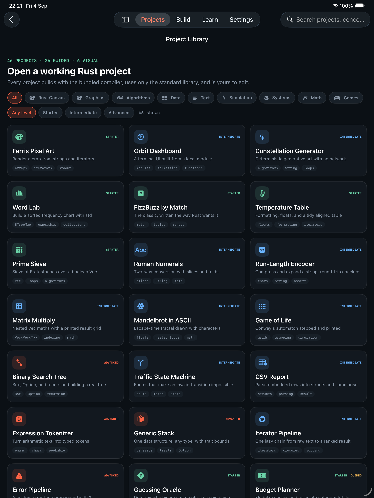

# Crabrix — native Rust workspace for iPhone and iPad

Crabrix is a **native SwiftUI application** that compiles and runs real Rust on
an iPhone or iPad. There is no WebView, no localhost server, no JavaScript
runtime, and no cloud compiler: `rustc` itself ships inside the app and executes
on the device.

> Real Rust. Real Cargo. Built locally on iPhone and iPad.

[**crabrix.com**](https://crabrix.com) · [About](https://crabrix.com/about) ·
[Support](https://crabrix.com/support) ·
[Privacy](https://crabrix.com/privacy) · [Terms](https://crabrix.com/terms)

| | |
| :--: | :--: |
|  |  |
| **Projects** — current project, import, and My Projects | **Library** — 46 working projects, 6 visual canvases |
|  |  |
| **Build** — editor, packages, diagnostics, terminal | **Learn** — 142 Rust lessons + 200 algorithm patterns |

<p align="center">
  
  <br><em>The iPad workspace: file tree and resolved packages, editor, and the build inspector.</em>
</p>

<p align="center">
  
</p>

## What it does

- **Compiles Rust on device.** A pinned WASI build of `rustc` runs inside a Swift WebAssembly interpreter. The first compile is real; identical repeat runs come from a local artifact cache.
- **Resolves and builds crates.io packages.** Sparse-index resolution, SemVer and feature unification, checksum-verified downloads, dependency compilation, and `--extern` linking — all on the device.
- **Health and energy, scaled by rating.** Wrong answers in a lesson cost health; a new lesson page costs energy, once ever. Both refill on their own, and a higher rank means a bigger pool *and* a faster refill. Training — Quick Practice, Term Train, Code Recall — never costs anything, so there is always a way to keep learning.
- **Teaches from the compiler.** 142 guided Rust lessons across six language courses, plus a 200-pattern Algorithm Atlas with two explanations and one local Rust challenge per pattern.
- **Achievements have ladders.** 36 families of five tiers each — Bronze to Diamond — including an overall Algorithm Atlas ladder and one ladder for each of its 20 solution methods.
- **Rating follows the diff.** A successful run is scored on how much Rust actually changed since the last one, so pressing Run on an untouched sample is worth almost nothing and real editing is worth real points.
- **Works offline.** Once a project's packages are cached, it rebuilds with the network off.

The app embeds:

- a SwiftUI editor and result UI;
- [WasmKit 0.3.1](https://github.com/swiftwasm/WasmKit), a WebAssembly interpreter written in Swift with iOS support;
- a pinned WASI build of `rustc` and its `wasm32-wasip1` sysroot from [Weblings / wasm-rustc](https://github.com/AngelOnFira/wasm-rustc/releases/tag/artifacts-test-7);
- structured `rustc` JSON diagnostic parsing for the E0502 experiment;
- local execution of the Wasm program emitted by the bundled compiler;
- an adaptive native `Projects / Build / Learn / Settings` navigation shell (top tab/sidebar on iPad, bottom tab bar on iPhone);
- an editable `UITextView` code editor with Rust and Cargo TOML syntax highlighting;
- a parsed Cargo project layout with `Cargo.toml`, `src/main.rs`, sibling modules, colored file-type icons, and native file/folder creation;
- Files/Working Copy folder import, `.crabrixproject` package export, and a persistent recent-project library with last-build status;
- bounded public GitHub snapshot import for repository and branch URLs, Cargo-root discovery, and stored source provenance;
- an iOS Share Extension that queues GitHub URLs through an App Group and never tries to foreground the host app;
- six courses covering the language end to end — foundations, ownership, data modelling, abstractions, Cargo projects, smart pointers, concurrency, async, macros, and systems Rust — plus interview prep that reaches past the language into memory, networking, databases, and distributed systems: 142 guided Rust lessons in total;
- a seventh Algorithms course with 20 solution-method chapters, 200 reusable patterns, and 600 ordered steps on a winding learning path: HOW, WHEN, then a compiler-backed Rust challenge;
- Quick Practice, Term Train (practice and timed modes, streaks, accuracy), and Code Recall, a memory drill that hides a snippet and asks you to rebuild it — all three generated from the lesson content and scheduled with SM-2 spaced repetition;
- a rating earned across every part of the app, 36 achievement ladders of five tiers each, with algorithm-category mastery tracked idempotently, a tiered unlock animation, and health/energy that scale with rank — all stored on device;
- a project library of 20 std-only projects across eight categories, searchable and filterable by difficulty, every one verified to compile and run with the bundled toolchain;
- draggable/collapsible project and diagnostic panels on iPad, plus stable full-height `Code / Problems / Output / Terminal` workspace tabs with highlighted streams/commands and live build state on both the workspace and project library;
- a review-before-insert Rust completion action: deterministic offline suggestions everywhere and optional Apple Foundation Models completion on eligible iOS 26+ devices;
- Auto, Light, and Dark themes, adjustable editor text, build keep-awake control, and a searchable crates.io catalog with owner/download metadata and per-package version selection;
- **a working Cargo package manager**: sparse-index resolution, SemVer and feature unification, checksum-verified `.crate` downloads, bounded extraction, dependency compilation to `.rlib`/`.rmeta`, and `--extern` linking into the final program;
- a per-package compatibility view backed by a persisted ledger of real build results, plus Cargo storage accounting and cache controls in Settings;
- a bounded guest runtime with 64 MiB linear-memory and table-growth limits, `/sandbox` as the only writable preopen, and no network imports.

## Cargo package manager

Crabrix resolves and builds real crates.io dependencies on device.

```
Cargo.toml
  → sparse index (https://index.crates.io)
  → SemVer selection + feature unification + target-predicate filtering
  → .crate download, SHA-256 verified against the index checksum
  → bounded gzip/tar extraction into the app cache
  → rustc --crate-type lib per package, artifacts keyed by fingerprint
  → rustc --extern name=... -L dependency=... for the program
  → run in the bounded WasmKit sandbox
```

What the resolver implements:

- the crates.io sparse index layout (`1/a`, `2/ab`, `3/a/abc`, `ab/cd/abcdef`), cached on disk so a resolved project stays resolvable offline;
- Cargo's caret, tilde, wildcard, exact, and comparator-range requirements, including the `^0.x` and `^0.0.z` narrowing rules and the prerelease opt-in rule;
- SemVer compatibility buckets, so incompatible major versions of one crate coexist while compatible ranges unify onto a single copy;
- feature resolution with `default`, `dep:name`, `name/feature`, weak `name?/feature`, and implicit optional-dependency features;
- `[target.'cfg(...)'.dependencies]` evaluation against `wasm32-wasip1`, which keeps Windows- and Linux-only crates out of the graph;
- dev- and build-dependency exclusion, renamed dependencies (`package = "..."`), and yanked-version avoidance;
- a generated `Cargo.lock` in Cargo's current format.

Compilation caches per build unit. A unit's fingerprint covers the toolchain,
crate version, checksum, edition, resolved features, library path, and the
fingerprints of its own dependencies, so changing a feature or bumping a
transitive crate invalidates exactly what it should. `cargo check` builds
dependency `.rmeta` only; `Run` builds `.rlib`s.

Caching is not a nicety here. `rustc` runs inside a Wasm interpreter, so one
crate costs minutes rather than seconds: on an iPhone 16 Pro simulator a first
build of a project with `smallvec` takes about five minutes end to end, and the
identical second build finishes in under a second from cache. The build controls
name the package currently compiling for exactly that reason, and `Stop`
interrupts it.

### Known limits

The bundled `rustc` is a WASI build with a Cranelift-to-Wasm backend and no
linker, which constrains what can compile:

- **procedural macros** cannot run — they need a host compiler, so `serde`'s `derive` feature and similar are reported as unsupported rather than silently mis-built;
- **build scripts are not executed**. Many crates whose `build.rs` only probes compiler features still build correctly, and those are marked "needs review" rather than blocked;
- crates that **link a native library** (`links = "..."`) or build only as `cdylib`/`staticlib` are unsupported;
- the codegen backend has real gaps. `ryu 1.0.23` and `itoa 1.0.18` currently fail with `umulhi on i64` and `ireduce i16 -> i8` respectively, while `arrayvec`, `cfg-if`, `either`, `itoa 1.0.11`, `log`, `memchr`, `once_cell`, and `smallvec` build and link.

Because static inspection cannot predict a codegen gap, Crabrix records the
outcome of every dependency build in a local ledger and shows `Verified`,
`Expected compatible`, `Needs review`, or `Unsupported` with the compiler's own
reason.

The toolchain is downloaded **at build time**, verified by SHA-256, and copied into the app bundle. The running app never downloads compiler components.

Runtime network access is limited to explicit user actions: public GitHub snapshot import, crates.io package discovery, and Cargo dependency resolution and download. Every `.crate` archive is verified against the SHA-256 checksum published in the registry index before it is written to disk, and both GitHub and crate archives are rejected when they contain traversal paths, symlinks, non-regular entries, too many files, or exceed the compressed/expanded size limits. Imported programs still execute in the network-free Wasm sandbox.

The project terminal is an app-scoped command console, not an arbitrary iOS
shell. It keeps a separate transcript per project and maps `cargo check`,
`cargo run`, `cargo build`, `cargo fetch`, `cargo tree`, `ls`, `cat`, `pwd`, and
`clear` to Crabrix's native project and compiler operations. `cargo tree` prints
the actual resolved graph with per-package compatibility markers.

`Stop` interrupts the running guest rather than only detaching the UI from it.
Crabrix wraps WASI imports and vendors a narrowly documented WasmKit patch with
an instruction budget, so even a pure `loop {}` traps without waiting for a host
call. Runtime watchdogs separately enforce wall-clock, output, writable-file,
memory, and table limits; after a stop, a fresh guest can start immediately.

The learning build profile favors iteration speed over optimized guest code.
`Run` emits an unoptimized teaching artifact, stores successful `program.wasm`
output under a source/toolchain hash in the app cache, and freshly executes that
artifact on an unchanged repeat run. The first compile still invokes the real
bundled `rustc`; subsequent identical runs avoid recompilation, including after
an app restart while iOS retains the cache.

Apple Intelligence completion is also local and optional. Crabrix checks
`SystemLanguageModel.availability` at runtime and falls back to its small,
deterministic Rust completion table when the system model, supported hardware,
or Apple Intelligence setting is unavailable. Suggested text is never inserted
without an explicit user action.

The Share Extension and host app use `group.com.sergiiziborov.Crabrix`. A signing team must register that App Group before installing this target on a physical device.

## Privacy

Crabrix has no account, no analytics SDK, no advertising, and no tracking. Your
code, projects, build output, and progress never leave the device. Game Center
and the Crabrix Rust Board implementations are retained behind explicit release
flags, but both are dormant in production 1.0 while their provisioning and
signed-event/moderation gates are completed.

The full policy is at [crabrix.com/privacy](https://crabrix.com/privacy), and the
App Store privacy manifest that has to agree with it is
[`Crabrix/Resources/PrivacyInfo.xcprivacy`](Crabrix/Resources/PrivacyInfo.xcprivacy).

## App Store compliance

The App Store review guidelines that actually bite for an app like this, and what
Crabrix does about each:

| Guideline | How Crabrix satisfies it |
| --- | --- |
| **2.5.2** — self-contained code | The compiler and standard library are **bundled**, not downloaded. The only code fetched at runtime is crates.io package source, at the user's explicit request, used only to build their own project. Every extracted file is readable in-app (Build → Packages → tap a crate), which is the condition the educational carve-out attaches. |
| **2.5.1** — private APIs, process spawning | No host processes are spawned. The project terminal is a simulated shell over the in-app project files. Guest programs run in a WebAssembly sandbox with a memory cap, one writable preopen, and no network imports. |
| **1.2** — user-generated content | Production 1.0 exposes no public board or display-name input. The retained board code stays dormant until report/hide/moderation are release-ready. |
| **5.1.1(v)** — account deletion | There is no account and production 1.0 creates no server-side profile. |
| **5.1.1** — privacy policy | Published at [/privacy](https://crabrix.com/privacy) and linked from Settings → About Crabrix. |
| **Privacy manifest** | `PrivacyInfo.xcprivacy` ships in both the app and the Share extension, declares the required UserDefaults/file-timestamp reasons, and declares no collected data for production 1.0. |
| **2.1** — completeness | No control ships that cannot work. Game Center and Crabrix Board are dormant behind release flags until their gates pass; no dead board controls are shown. |
| **2.3** — accurate metadata | The listing copy in [docs/app-store/listing.md](docs/app-store/listing.md) states the limits — crates needing C code or proc macros cannot build on device — rather than only the strengths. |

Listing copy, App Privacy answers, review notes, and the pre-submission checklist
are in [docs/app-store/listing.md](docs/app-store/listing.md).

## Price

Crabrix is a **one-time purchase**. There is no subscription, no in-app purchase, and
no feature held back for a second transaction.

| | |
| --- | --- |
| Launch price | **$17.99** |
| Regular price | **$24.99** |
| Devices | Universal — iPhone and iPad, one purchase |
| Accounts | None. No sign-in, no cloud sync, no analytics |
| Version | 1.0 (build 1) |
| Updates | Included |

The compiler, the package manager, the project library, and the whole curriculum ship
in the app itself. Nothing runs on a server on your behalf, so there is no recurring
cost to pass on.

## License and ownership

Crabrix is commercial proprietary software, not an open-source MIT project.
Copyright © 2026 Serhii Ziborov. All rights reserved. The source is publicly
visible for review and evaluation; reuse, modification, redistribution, sale,
or derivative works require prior written authorization. See [LICENSE](LICENSE).

Bundled third-party components keep their original licenses. Their required
attributions are maintained in
[Crabrix/Resources/ThirdPartyNotices.md](Crabrix/Resources/ThirdPartyNotices.md),
which ships inside the app and is readable at **Settings → About Crabrix →
Open-source licenses**.

Rust and the Rust logo are trademarks of the Rust Foundation. Crabrix is an
independent project and is not affiliated with or endorsed by the Rust Foundation
or by Apple.

## Build

Requirements:

- Xcode 27 beta or newer (Swift 6.3+ is required by WasmKit 0.3.1);
- XcodeGen;
- `zstd` on the build Mac.

```bash
./scripts/bootstrap.sh
DEVELOPER_DIR=/Applications/Xcode-beta.app/Contents/Developer \
  xcodebuild -project Crabrix.xcodeproj \
  -scheme Crabrix \
  -destination 'platform=iOS Simulator,name=iPad Pro 13-inch (M5),OS=26.5' \
  build
```

Simulator builds need no signing configuration.

### Building for a device

No signing team is checked in — `project.yml` deliberately carries no
`DEVELOPMENT_TEAM`, so nothing account-specific reaches the repository. Supply
yours locally instead, in a git-ignored `.env`:

```bash
echo "CRABRIX_DEVELOPMENT_TEAM=YOURTEAMID" > .env   # .env is git-ignored
./scripts/device-build.sh
```

The script builds, installs, and launches on the first connected device. You can
also export `CRABRIX_DEVELOPMENT_TEAM`, pass the team as the first argument, or
set `CRABRIX_DEVICE` to target a specific device. Find your team id with
`security find-identity -v -p codesigning`.

One account-side step is needed once: register the App Group
`group.com.sergiiziborov.Crabrix` for both `com.sergiiziborov.Crabrix` and
`com.sergiiziborov.Crabrix.Share`. In Xcode that is the target's *Signing &
Capabilities* tab → **+ Capability** → **App Groups**. Without it, signing fails
with an entitlement mismatch on both targets.

## Verification

The normal test scheme excludes the expensive compiler gates:

```bash
DEVELOPER_DIR=/Applications/Xcode-beta.app/Contents/Developer \
  xcodebuild -project Crabrix.xcodeproj \
  -scheme Crabrix \
  -destination 'platform=iOS Simulator,name=iPad Pro 13-inch (M5),OS=26.5' \
  test
```

Run the real bundled-compiler gates with the dedicated scheme:

```bash
DEVELOPER_DIR=/Applications/Xcode-beta.app/Contents/Developer \
  xcodebuild -project Crabrix.xcodeproj \
  -scheme CrabrixCompilerGate \
  -destination 'platform=iOS Simulator,name=iPad Pro 13-inch (M5),OS=26.5' \
  test
```

Measured on the iPad Pro 13-inch (M5) Simulator used for this spike:

- optimized Release multi-file compile/run with safe token threading: 3.3 seconds;
- unoptimized Debug compile/run: approximately 50–59 seconds;
- unchanged cached Debug run after an app restart: 44 milliseconds on the same Simulator;
- three consecutive optimized compile/run cycles: approximately 10–11 seconds total;
- an 80 MiB guest allocation is rejected by the 64 MiB sandbox gate;
- public `AngelOnFira/weblings` snapshot import opens 21 bounded text/source files in the native editor on Simulator;
- unsigned ARM64 `iphoneos` build: succeeds;
- signed Release install and launch smoke test: succeeds on an iPhone 13 mini running iOS 26.5;
- uncompressed Simulator `.app` bundle: approximately 160 MB (152 MB toolchain payload).

The local free-development provisioning profile used for that install smoke
test did not include App Groups. It validates the host app's installation and
launch, but not Share Extension handoff; that path still requires the registered
App Group described above.

WasmKit 0.3.1's direct-threaded interpreter crashed in an optimized iOS
Simulator build while running the bundled `rustc` module. Crabrix explicitly
uses WasmKit's token-threaded fallback, which passed the Release multi-file gate.
The current memory limiter uses WasmKit's narrow `Fuzzing` SPI because the
public `ResourceLimiter` protocol is exposed while `Store.resourceLimiter` is
still SPI. This is tracked as a dependency-integration debt, not hidden as a
production-stable API.

The current Stop button immediately releases the app UI, ignores the stale
compiler result, and reports sandbox cleanup. WasmKit 0.3.1 does not expose a
safe hard-interruption/fuel API for an already-running interpreter, so Crabrix
does not start a second compiler job until that worker has drained. A true
hard-timeout remains part of the physical-device gate.

These numbers prove the native integration path, not physical-device performance.

## Success criteria

The compiler gate passes only when all of these are demonstrated on a physical iPhone/iPad:

1. airplane mode is enabled before launch;
2. the app reports `Bundled rustc.wasm`;
3. **Check** produces a real E0502 JSON diagnostic;
4. the repaired program compiles and **Run** prints `crab`;
5. repeated checks stay within an acceptable memory/thermal envelope;
6. a non-terminating program can be stopped without leaving runaway work.

Items 1, 5 and 6 cannot be claimed from a Simulator run. See [docs/DEVICE-GATE.md](docs/DEVICE-GATE.md).

## Repository history

The earlier browser experiment is preserved in the `archive/web-poc` branch only. It is not part of the native app or its runtime.
