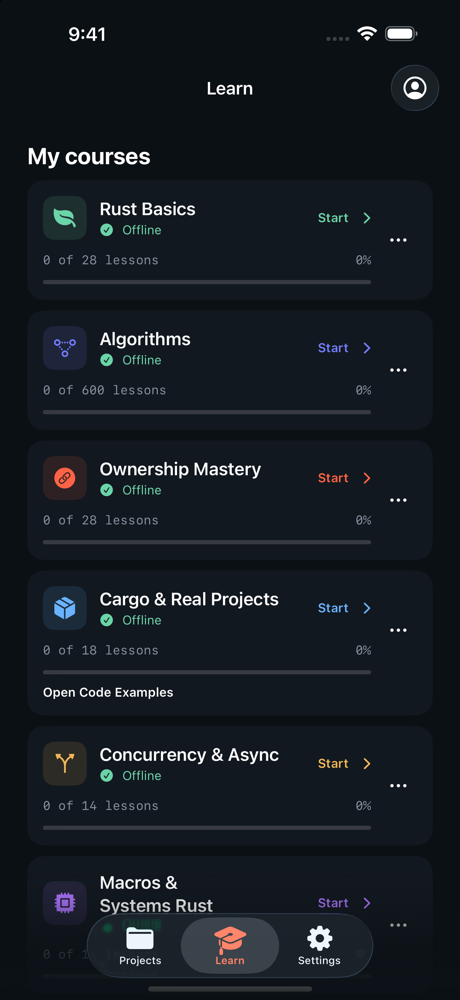

# Crabrix

**Learn Rust, then make it run.** Crabrix brings the full Academy and a real project workspace to iPhone and iPad. Follow a lesson, turn its source into your own project, see actual compiler diagnostics, and run Rust locally. Cargo support and the compiler live in the app; no account or cloud compiler is required.

[Website](https://crabrix.com) · [Support](https://crabrix.com/support) · [Privacy](https://crabrix.com/privacy) · [App license](LICENSE)

<p>
  
  
  
  
</p>

## Use Crabrix

Open **Learn**, choose a course to download, and read it offline. Open a lesson starter as an editable project. In the project workspace, use **Check** to see compiler diagnostics, then **Run** to execute the program. The three-dot button opens project settings, save, and share. Code, Problems, Output, and Terminal switch from the bottom of the editor; hints appear in Output for lesson projects. A project is a durable copy: editing or deleting course material does not edit that project.

**Projects** opens a short entry screen. **My Projects** opens the project manager; GitHub and Files/iCloud Drive imports live under **New Project**. The workspace opens on **Code** and returns to Code when you select another file. Project dependencies stay with that project. Settings offer Auto, Light, Dark, and a global Cyberpunk appearance, plus optional Face ID or device-passcode app protection. Rating and achievements remain local; Health and Energy are no longer part of learning or practice.

The Academy contains seven courses: six Rust language courses and Algorithm Atlas. The signed 1.0.1 baseline contains **742 lessons** (142 Rust lessons and 600 Atlas steps), **200 Atlas challenges**, 46 editable **Examples** in the Projects course, source projects, questions, answers, depth material, and 358 term pairs. The Examples gallery opens from the downloaded Projects course; choosing one creates a separate project in My Projects. Example Rust sources live in the signed Projects CoursePack, not in the compiled app code. A fresh install lists all seven courses for individual download; none is installed automatically. Existing learners keep their migrated offline material. Learn shows installed courses first, with their offline status, lesson progress and direct entry; remaining courses have individual Download buttons and visible sizes. Practice follows the installed courses without an introductory banner. Removing an offline copy keeps projects and progress. Inside a course, Reset course progress restarts its lessons and answers while keeping projects and earned rewards. Course sources, build tools, manifests, and release archives are public in [crabrix-courses](https://github.com/sergii-ziborov/crabrix-courses). The course text and media have their own [content terms](https://github.com/sergii-ziborov/crabrix-courses/blob/main/CONTENT-LICENSE.md).

For Cargo projects, Crabrix resolves a supported subset of crates.io dependencies, verifies registry checksums, builds dependencies locally, and can pin their source archives for offline rebuilds. An installed course is readable offline; an exercise using crates is offline ready only after its dependencies have been prepared. The editor, diagnostics, Academy Examples, import/export, and training activities remain native UI.

## Runtime and compiler

Crabrix 1.1 pins [CrabrixRuntime](https://github.com/sergii-ziborov/crabrix-runtime) at `d996f0d11dff54734b5670d58062e22c6e01f949`, derived from WasmKit **0.4.1** (`a0471eaee817c523b8023d8ebb1c70ff70b7950a`). The adapter uses upstream fuel metering, a separate cancellation/deadline probe sampled at fuel checkpoints, read-only compiler inputs, bounded WASI output, fresh execution stores, and virtual memory reservation to avoid copying the compiler's full Wasm memory on growth. Software-bounds execution uses token dispatch after an out-of-bounds regression was found in direct dispatch. The Wasm guest has no network import.

In an A/B/A Release Simulator measurement using the same compiler and a heavy multi-crate CLI project, this runtime completed the selected workload **about 1.6× faster** than the preceding Crabrix runtime. The [raw observations](docs/performance/2026-10-02-sampled-cancellation-heavy-cli-simulator.json) document the source graph, output checks, cache preparation, and measurement limits. This result describes that workload on Simulator; other projects and devices need their own measurements. [Runtime integration](docs/runtime-integration.md) explains the implementation.

Build 15 pins the [Crabrix source-built Rust toolchain](https://github.com/sergii-ziborov/crabrix-toolchain/releases/tag/toolchain-2026-10-02.1), `crabrix-rust-2026-10-02.1`. Its `rustc.wasm` and `wasm32-wasip1` sysroot are built from locked source and published with a signed descriptor, notices, compatibility results, and a two-build difference report. The build Mac verifies the descriptor and every artifact before bundling them; the phone does not download compiler or runtime updates. The two source builds have different raw digests, so the release claims source-pinned inputs rather than byte-identical reproducibility. See [toolchain provenance and limits](docs/toolchain.md).

The release graph has one runtime dependency. CoursePacks contain data, text, media, and editable Rust source; they cannot replace the compiler or install executable plugins. [Architecture](docs/architecture.md) and [course delivery](docs/course-delivery.md) explain the boundaries.

## Build from source

The Release Simulator gates used Xcode 27.0 beta (`27A5228h`); the signed iOS archive used Xcode 27.0 stable (`27A266a`). XcodeGen and `zstd` are build tools. The app deployment target is iOS 18. Package versions and the runtime revision are pinned in [Dependencies/Package.resolved](Dependencies/Package.resolved) and [project.yml](project.yml). A signing team is needed only for a physical device; the bundle IDs and App Group remain unchanged.

```bash
./scripts/bootstrap.sh
xcodebuild build -project Crabrix.xcodeproj -scheme Crabrix \
  -configuration Debug -destination 'generic/platform=iOS Simulator' \
  -onlyUsePackageVersionsFromResolvedFile
```

`bootstrap.sh` downloads the signed Crabrix toolchain release, verifies its Ed25519 descriptor, asset hashes and sysroot file inventory, packages the verified resources, regenerates the Xcode project, and restores the audited SwiftPM resolution. The Share Extension needs the registered App Group `group.com.sergiiziborov.Crabrix` for a signed device build. Use `./scripts/device-build.sh` with a local signing team after that account setup.

## Verify

The normal scheme runs app and content tests. Separate schemes opt into the expensive compiler and public network gates:

```bash
xcodebuild test -project Crabrix.xcodeproj -scheme Crabrix \
  -configuration Debug -destination 'platform=iOS Simulator,name=Crabrix iOS18 Tests'
xcodebuild test -project Crabrix.xcodeproj -scheme CrabrixCompilerGate \
  -configuration Debug -destination 'platform=iOS Simulator,name=Crabrix iOS18 Tests'
xcodebuild test -project Crabrix.xcodeproj -scheme CrabrixCourseDeliveryGate \
  -configuration Debug -destination 'platform=iOS Simulator,name=Crabrix iOS18 Tests'
```

The named Simulator is a local development device; choose an installed iOS Simulator on another Mac. [Validation](docs/VALIDATION.md) records commands and observed outcomes without treating a written test as a passed test. A physical device pass is a separate release gate.

## Compatibility and limits

- The bundled compiler targets `wasm32-wasip1`. Rust procedural macros, native linking, and executable Cargo build scripts are outside the supported local Cargo subset.
- Crate compatibility is measured per package. A successful metadata Check does not prove code generation or linking.
- Course update crash injection, physical-device performance and Face ID behavior still need their release gates. Selected Simulator gates include compiler output budgeting and supported heavy projects; [current validation](docs/VALIDATION.md) gives their exact scope.
- Internet is needed to download a selected course, discover/download crates, and import a GitHub project. Compilation and program execution stay on device.

## Privacy, support, and licenses

Crabrix has no required account, analytics SDK, advertising, or cloud compiler. Projects, progress, and build output are local unless you explicitly export or share them. Course downloads use GitHub's public delivery hosts, which receive ordinary HTTP requests and may retain access logs. crates.io and GitHub imports are user initiated. The guest program has no network import. See the [privacy policy](https://crabrix.com/privacy) and the bundled `PrivacyInfo.xcprivacy` for the shipping disclosure.

The application is public source under its existing [license](LICENSE); public source does not grant permission to reuse the commercial app. WasmKit, the builder, Rust, and other components retain their upstream licenses and notices in [third party notices](Crabrix/Resources/ThirdPartyNotices.md) and `Crabrix/Resources/Licenses/`. Crabrix is independent of the Rust Foundation, Apple, and the WasmKit maintainers.
