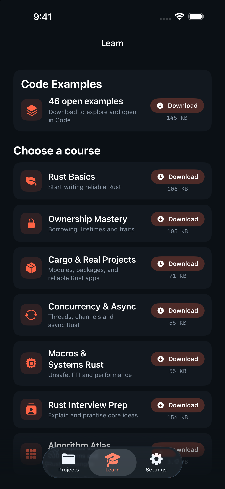
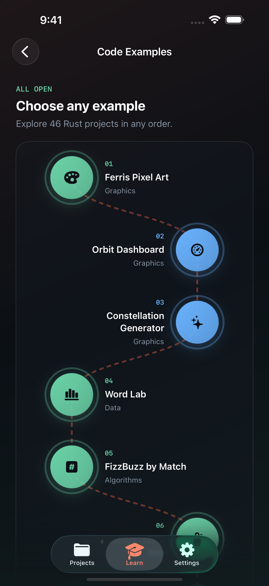
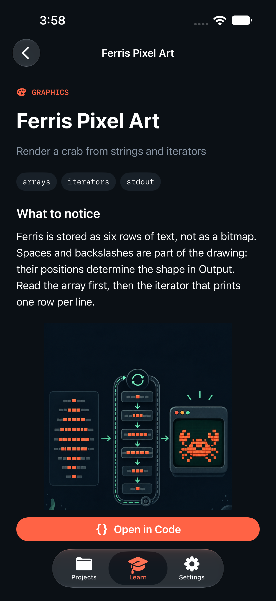
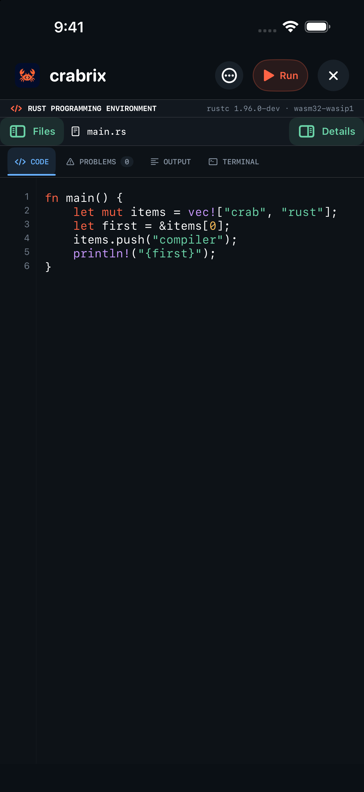

# Crabrix

**Learn Rust, then make it run.** Crabrix brings the full Academy and a real project workspace to iPhone and iPad. Follow a lesson, turn its source into your own project, see actual compiler diagnostics, and run Rust locally. Cargo support and the compiler live in the app; no account or cloud compiler is required.

[Website](https://crabrix.com) · [Next.js site and free Learn source](site/README.md) · [Support](https://crabrix.com/support) · [Privacy](https://crabrix.com/privacy) · [Changelog](CHANGELOG.md) · [App license](LICENSE)

<p>
  
  
  
  
  
</p>

The [iPad workspace](docs/screenshots/ipad-build.png) shows the file sidebar and the new in-file search above the editor. The [Duo code workspace](docs/screenshots/duo-laptop.png) shows its project header, search, tabs, shortcuts, and keyboard; [Duo Output](docs/screenshots/duo-output.png) shows the completed run, standard output, and rating. The iPhone, iPad, and Duo captures come from the current Release Simulator source.

## Use Crabrix

Open **Learn**, choose a course to download, and read it offline. Open a lesson starter as an editable project. In the project workspace, use **Check** to see compiler diagnostics, then **Run** to execute the program. The three-dot button opens project settings, save, and share. Code, Problems, Output, and Terminal switch from the bottom of the editor; hints appear in Output for lesson projects. A project is a durable copy: editing or deleting course material does not edit that project.

**Projects** opens a short entry screen. **My Projects** opens the project manager; GitHub and Files imports live under **New Project**. The editor stays inside Projects, with Projects, Learn, and Settings available while editing or reading lessons. On iPhone, these primary tabs remain at the bottom. In Duo laptop posture, the workspace header shows the project name and in-file search, while Code, Problems, Output, and Terminal sit above the keyboard. The keyboard controls stay beside the code tabs, and the editor shortcuts stay directly above the keyboard. Output now gives a clear result for completed, empty, failed, and stopped runs. The workspace opens on **Code** and returns to Code when you select another file. Each folder's add menu creates nested Rust files, text files, or module folders. Project dependencies stay with that project. Settings offer Auto, Light, Dark, and a global Cyberpunk appearance, plus optional Face ID or device-passcode app protection. Rating and achievements are earned locally and are available from a lesson header. Profile offers an **off-by-default Game Center** switch for Apple's global rating leaderboard and all 37 achievement ladders (plus ten earlier individual milestones); turning it off keeps all local progress. Health and Energy are no longer part of learning or practice.

The Academy contains seven courses: six Rust language courses and Algorithm Atlas. The signed baseline contains **742 lessons** (142 Rust lessons and 600 Atlas steps), **200 Atlas challenges**, source projects, questions, answers, depth material, and 358 term pairs. All 742 lessons and steps are included in the [new free Learn site](site/README.md), running on a private Hetzner endpoint while public routing is pending; the app adds offline study, editable projects, local compilation, practice, and progress. **Code Examples** is a separate optional download in Learn with 46 editable Rust projects. All 46 stops are open: each shows its project-specific guide, selected local infographics, and a real source preview, with **Open in Code** to create a durable copy in My Projects. Every project has its own README and retains its source pack identity. Example Rust sources live in the signed Examples CoursePack, outside the compiled app code. A fresh install offers each course and Examples for individual download; none is installed automatically. Existing learners keep their migrated offline courses and can still open the older gallery from an installed Projects pack. Learn shows installed courses, a Code Examples card, practice, and remaining downloads with their sizes. Tap an installed card to open it; swipe left or use its options menu to remove downloaded material after confirmation. Removing material keeps projects and progress. Inside a course, Reset course progress restarts its lessons and answers while keeping projects and earned rewards. Course sources, build tools, manifests, and release archives are public in [crabrix-courses](https://github.com/sergii-ziborov/crabrix-courses). The course text and media have their own [content terms](https://github.com/sergii-ziborov/crabrix-courses/blob/main/CONTENT-LICENSE.md).

For Cargo projects, Crabrix resolves a supported subset of crates.io dependencies, verifies registry checksums, builds dependencies locally, and can pin their source archives for offline rebuilds. `syn`, `quote`, and `proc-macro2` use a parser-only feature profile that works with the bundled WASI compiler; an existing plain `syn` dependency can be repaired from the project package panel. Procedural macro crates and build scripts remain unsupported. An installed course is readable offline; an exercise using crates is offline ready only after its dependencies have been prepared. The editor, diagnostics, Code Examples path, import/export, and training activities remain native UI.

## Runtime and compiler

Crabrix 1.1 pins [CrabrixRuntime](https://github.com/sergii-ziborov/crabrix-runtime) at `d996f0d11dff54734b5670d58062e22c6e01f949`, derived from WasmKit **0.4.1** (`a0471eaee817c523b8023d8ebb1c70ff70b7950a`). The adapter uses upstream fuel metering, a separate cancellation/deadline probe sampled at fuel checkpoints, read-only compiler inputs, bounded WASI output, fresh execution stores, and virtual memory reservation to avoid copying the compiler's full Wasm memory on growth. Software-bounds execution uses token dispatch after an out-of-bounds regression was found in direct dispatch. The Wasm guest has no network import.

In an A/B/A Release Simulator measurement using the same compiler and a heavy multi-crate CLI project, this runtime completed the selected workload **about 1.6× faster** than the preceding Crabrix runtime. The [raw observations](docs/performance/2026-10-02-sampled-cancellation-heavy-cli-simulator.json) document the source graph, output checks, cache preparation, and measurement limits. This result describes that workload on Simulator; other projects and devices need their own measurements. [Runtime integration](docs/runtime-integration.md) explains the implementation.

Build 26 pins the [Crabrix source-built Rust toolchain](https://github.com/sergii-ziborov/crabrix-toolchain/releases/tag/toolchain-2026-10-02.1), `crabrix-rust-2026-10-02.1`. Its `rustc.wasm` and `wasm32-wasip1` sysroot are built from locked source and published with a signed descriptor, notices, compatibility results, and a two-build difference report. The build Mac verifies the descriptor and every artifact before bundling them; the phone does not download compiler or runtime updates. The two source builds have different raw digests, so the release claims source-pinned inputs rather than byte-identical reproducibility. See [toolchain provenance and limits](docs/toolchain.md).

The release graph has one runtime dependency. CoursePacks contain data, text, media, and editable Rust source; they cannot replace the compiler or install executable plugins. [Architecture](docs/architecture.md) and [course delivery](docs/course-delivery.md) explain the boundaries.

## Build from source

The signed build 26 archive used Xcode 27.1 RC (`27A9275`); its exact inputs and artifact hash are in the [release manifest](docs/releases/1.1-build26.json). XcodeGen and `zstd` are build tools. The app deployment target is iOS 18. Package versions and the runtime revision are pinned in [Dependencies/Package.resolved](Dependencies/Package.resolved) and [project.yml](project.yml). A signing team is needed only for a physical device; the bundle IDs and App Group remain unchanged.

```bash
./scripts/bootstrap.sh
xcodebuild build -project Crabrix.xcodeproj -scheme Crabrix \
  -configuration Debug -destination 'generic/platform=iOS Simulator' \
  -onlyUsePackageVersionsFromResolvedFile
```

`bootstrap.sh` downloads the signed Crabrix toolchain release, verifies its Ed25519 descriptor, asset hashes and sysroot file inventory, packages the verified resources, regenerates the Xcode project, and restores the audited SwiftPM resolution. The Share Extension needs the registered App Group `group.com.sergiiziborov.Crabrix` for a signed device build. Use `./scripts/device-build.sh` with a local signing team after that account setup.

For a distribution archive, provide `CRABRIX_APP_PROFILE` and `CRABRIX_SHARE_PROFILE` as the names of your installed App Store provisioning profiles and set `DEVELOPMENT_TEAM`. The app profile must include the Game Center entitlement. These profile names are build inputs, not repository credentials; the profiles and signing keys stay outside Git.

## Verify

The normal scheme runs app and content tests. Separate schemes opt into the expensive compiler and public network gates:

```bash
xcodebuild test -project Crabrix.xcodeproj -scheme Crabrix \
  -configuration Debug -destination 'platform=iOS Simulator,name=Crabrix iOS18 Tests'
xcodebuild test -project Crabrix.xcodeproj -scheme CrabrixCompilerGate \
  -configuration Debug -destination 'platform=iOS Simulator,name=Crabrix iOS18 Tests'
xcodebuild test -project Crabrix.xcodeproj -scheme CrabrixCourseDeliveryGate \
  -configuration Debug -destination 'platform=iOS Simulator,name=Crabrix iOS18 Tests'
```

The named Simulator is a local development device; choose an installed iOS Simulator on another Mac. [Validation](docs/VALIDATION.md) records commands and observed outcomes without treating a written test as a passed test. A physical device pass is a separate release gate.

## Compatibility and limits

- The bundled compiler targets `wasm32-wasip1`. Rust procedural macros, native linking, and executable Cargo build scripts are outside the supported local Cargo subset.
- Crate compatibility is measured per package. A successful metadata Check does not prove code generation or linking.
- Course update crash injection, physical-device performance and Face ID behavior still need their release gates. Selected Simulator gates include compiler output budgeting and supported heavy projects; [current validation](docs/VALIDATION.md) gives their exact scope.
- Internet is needed to download a selected course, discover/download crates, and import a GitHub project. Compilation and program execution stay on device.

## Privacy, support, and licenses

Crabrix has no required account, analytics SDK, advertising, or cloud compiler. Projects, course progress, and build output are local unless you explicitly export or share them. If you enable Game Center, Crabrix reports your numeric rating and achievement ladder progress to Apple; it operates no account or leaderboard server of its own. Course downloads use GitHub's public delivery hosts, which receive ordinary HTTP requests and may retain access logs. crates.io and GitHub imports are user initiated. The guest program has no network import. See the [Game Center details](docs/GAME-CENTER.md), [privacy policy](https://crabrix.com/privacy), and bundled `PrivacyInfo.xcprivacy`.

The application is public source under its existing [license](LICENSE); public source does not grant permission to reuse the commercial app. WasmKit, the builder, Rust, and other components retain their upstream licenses and notices in [third party notices](Crabrix/Resources/ThirdPartyNotices.md) and `Crabrix/Resources/Licenses/`. Crabrix is independent of the Rust Foundation, Apple, and the WasmKit maintainers.
