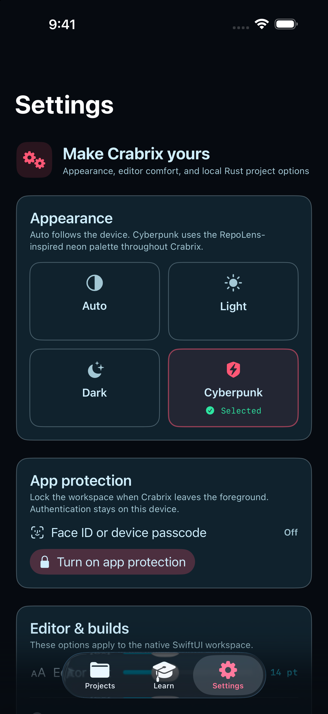

# Crabrix

Crabrix is a native Rust learning workspace for iPhone and iPad: edit a project, compile it with the Rust compiler bundled in the app, inspect diagnostics, and run the resulting WebAssembly program on device.

[Website](https://crabrix.com) · [Support](https://crabrix.com/support) · [Privacy](https://crabrix.com/privacy) · [App license](LICENSE)



## Use Crabrix

Open **Learn**, choose a course, and read a lesson or open its starter as an editable project. In the project workspace, use **Check** to see compiler diagnostics, then **Run** to execute the program. Hints appear in **Output** for lesson projects. A project is a durable copy: editing or deleting course material does not edit that project.

**Projects** opens a short entry screen. **My Projects** opens the project manager; GitHub and Files/iCloud Drive imports live under **New Project**. The workspace opens on **Code** and returns to Code when you select another file. Project dependencies stay with that project. Settings offer Auto, Light, Dark, and a global Cyberpunk appearance, plus optional Face ID or device-passcode app protection. Rating and achievements remain local; Health and Energy are no longer part of learning or practice.

The Academy contains seven courses: six Rust language courses and Algorithm Atlas. The signed 1.0.1 baseline contains **742 lessons** (142 Rust lessons and 600 Atlas steps), **200 Atlas challenges**, 46 editable **Examples** in the Projects course, source projects, questions, answers, depth material, and 358 term pairs. The Examples gallery opens from Academy; choosing one creates a separate project in My Projects. Example Rust sources live in the signed Projects CoursePack, not in the compiled app code. An existing learner's update activates all seven bundled CoursePacks offline; a fresh install opens with Basics and offers the other six, including Examples, from the signed public catalog. Course downloads show their size before transfer and leave an installed version usable until verification and activation finish. Course sources, build tools, manifests, and release archives are public in [crabrix-courses](https://github.com/sergii-ziborov/crabrix-courses). The course text and media have their own [content terms](https://github.com/sergii-ziborov/crabrix-courses/blob/main/CONTENT-LICENSE.md).

For Cargo projects, Crabrix resolves a supported subset of crates.io dependencies, verifies registry checksums, builds dependencies locally, and can pin their source archives for offline rebuilds. An installed course is readable offline; an exercise using crates is offline ready only after its dependencies have been prepared. The editor, diagnostics, Academy Examples, import/export, and training activities remain native UI.

## Runtime and compiler

The app pins [CrabrixRuntime](https://github.com/sergii-ziborov/crabrix-runtime) at `fbe46d928a4592ca274e5fdf07fdbafcf9538868`, derived from WasmKit **0.4.1** (`a0471eaee817c523b8023d8ebb1c70ff70b7950a`). The adapter uses upstream fuel metering, a separate cancellation/deadline probe, read-only compiler inputs, bounded WASI output, fresh execution stores, and virtual memory reservation to avoid copying the compiler's full Wasm memory on growth. Software-bounds execution uses token dispatch after an out-of-bounds regression was found in direct dispatch. The Wasm guest has no network import. [Runtime integration](docs/runtime-integration.md) and the [Release simulator measurements](docs/performance/2026-09-30-reserved-memory-safety-simulator.json) record the tested paths, measured speed, and remaining device gates.

The current app bundle still contains the pinned `artifacts-test-7` WASI `rustc` and `wasm32-wasip1` sysroot. They are fetched and hash checked on the **build machine**, then included in the app; the phone does not download compiler or runtime updates. [crabrix-toolchain](https://github.com/sergii-ziborov/crabrix-toolchain) is the public source locked builder. Its own compiler artifacts are not yet the app's release input; see [toolchain status](docs/toolchain.md). Source availability and a lock file are not evidence of a completed source build.

The release graph has one runtime dependency. CoursePacks contain data, text, media, and editable Rust source; they cannot replace the compiler or install executable plugins. [Architecture](docs/architecture.md) and [course delivery](docs/course-delivery.md) explain the boundaries.

## Build from source

The tested development environment for this branch is Xcode 27.0 beta (`27A5228h`) with Swift 6.4, XcodeGen, and `zstd`. The app deployment target is iOS 18. Package versions and the runtime revision are pinned in [Dependencies/Package.resolved](Dependencies/Package.resolved) and [project.yml](project.yml). A signing team is needed only for a physical device; the bundle IDs and App Group remain unchanged.

```bash
./scripts/bootstrap.sh
xcodebuild build -project Crabrix.xcodeproj -scheme Crabrix \
  -configuration Debug -destination 'generic/platform=iOS Simulator' \
  -onlyUsePackageVersionsFromResolvedFile
```

`bootstrap.sh` obtains the old pinned compiler artifacts with SHA-256 checks, packages them into the app resources, regenerates the Xcode project, and restores the audited SwiftPM resolution. The Share Extension needs the registered App Group `group.com.sergiiziborov.Crabrix` for a signed device build. Use `./scripts/device-build.sh` with a local signing team after that account setup.

## Verify

The normal scheme runs app and content tests. Separate schemes opt into the expensive compiler and public network gates:

```bash
xcodebuild test -project Crabrix.xcodeproj -scheme Crabrix \
  -configuration Debug -destination 'platform=iOS Simulator,name=Crabrix iOS18 Tests'
xcodebuild test -project Crabrix.xcodeproj -scheme CrabrixCompilerGate \
  -configuration Debug -destination 'platform=iOS Simulator,name=Crabrix iOS18 Tests'
xcodebuild test -project Crabrix.xcodeproj -scheme CrabrixCourseDeliveryGate \
  -configuration Debug -destination 'platform=iOS Simulator,name=Crabrix iOS18 Tests'
```

The named Simulator is a local development device; choose an installed iOS Simulator on another Mac. [Validation](docs/VALIDATION.md) records commands and observed outcomes without treating a written test as a passed test. A physical device pass is a separate release gate.

## Compatibility and limits

- The bundled compiler targets `wasm32-wasip1`. Rust procedural macros, native linking, and executable Cargo build scripts are outside the supported local Cargo subset.
- Crate compatibility is measured per package. A successful metadata Check does not prove code generation or linking.
- Compiler output stress, course update crash injection, device performance, and physical Face ID behavior still need their release gates. [Current validation](docs/VALIDATION.md) lists them explicitly.
- Internet is needed for course catalog/update fetches, crate discovery/downloads, and user requested GitHub imports. Compilation and program execution stay on device.

## Privacy, support, and licenses

Crabrix has no required account, analytics SDK, advertising, or cloud compiler. Projects, progress, and build output are local unless you explicitly export or share them. Course updates are fetched from GitHub's public delivery hosts, which receive ordinary HTTP requests and may retain access logs. crates.io and GitHub imports are user initiated. The guest program has no network import. See the [privacy policy](https://crabrix.com/privacy) and the bundled `PrivacyInfo.xcprivacy` for the shipping disclosure.

The application is public source under its existing [license](LICENSE); public source does not grant permission to reuse the commercial app. WasmKit, the builder, Rust, and other components retain their upstream licenses and notices in [third party notices](Crabrix/Resources/ThirdPartyNotices.md) and `Crabrix/Resources/Licenses/`. Crabrix is independent of the Rust Foundation, Apple, and the WasmKit maintainers.
